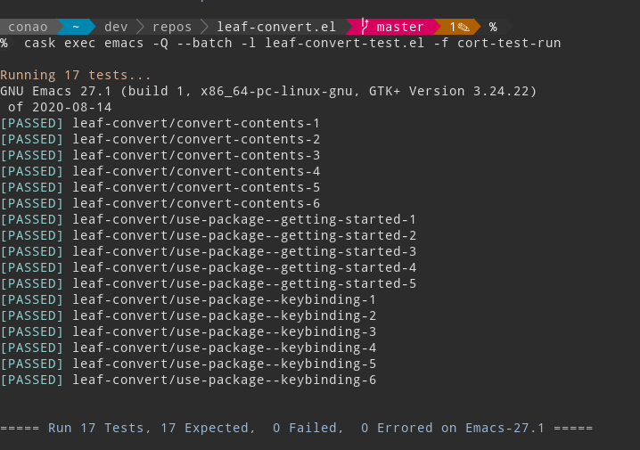
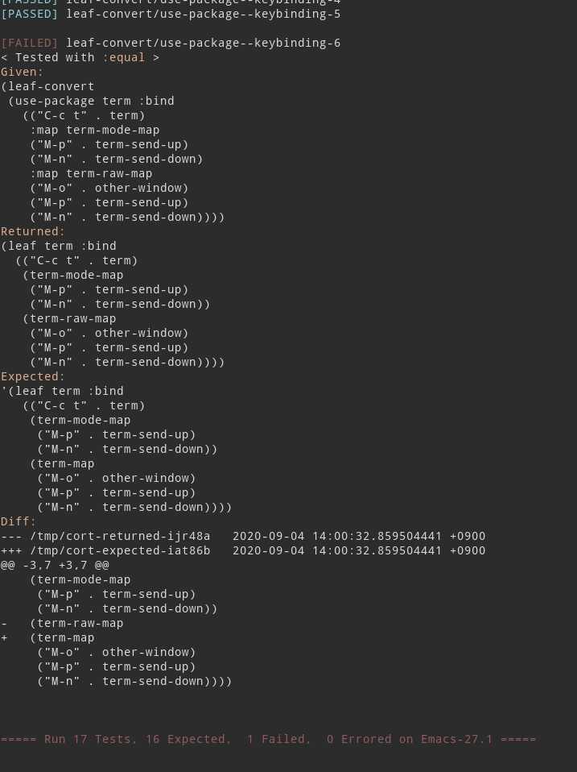



# 概要

[cort](https://github.com/conao3/cort.el/)は[conao3](https://github.com/conao3/)によって作成された、シンプルなElispテストフレームワークです。



異常系では次のように表示されます。 「何を実行して」、「何が返却されて」、「何を期待していて」、「何が違う」のか分かりやすく表示されています。



多くのテストを実行すると表示を煩わしく思うかもしれません。 cortは簡略表示機能を備えており、知りたい情報に集中することができます。


# 使用方法


## 準備


### Cask

[cask](https://github.com/cask/cask)などのパッケージマネージャと使うことをおすすめします。 まず `Cask` ファイルを次のように記載し、プロジェクトルートに配置します。

```elisp
;; Cask

(source gnu)
(source melpa)

(package-file "<<pkgname>>.el")

(development
 (depends-on "cort"))
```


### Makefile

Makefileは必須ではありませんが、便利です。

```makefile
## Makefile

all:

TESTFILE := <<pkgname>>-test.el

EMACS    ?= emacs
ELS      := $(shell cask files)

##############################

.PHONY: all build test clean

all: build

build: $(ELS:%.el=%.elc)

%.elc: %.el .cask
	cask exec $(EMACS) -Q --batch -f batch-byte-compile $<

.cask: Cask
	cask install
	touch $@

test: build
	cask exec $(EMACS) -Q --batch -l $(TESTFILE) -f cort-test-run

clean:
	cask clean-elc
	rm -rf .cask
```


## テスト定義

cortは `cort-deftest` によりテストを定義します。 しかし `cort-deftest` は少し冗長なので、基本的には `cort-deftest-generate` を使用してテストを定義します。


### cort-deftest

cortのテストを定義する基本的なマクロです。

引数は2つで、1つ目はテストの名前をシンボルで渡し、2つ目はテストケースのリストをクオートして渡します。 テストケースは2つの形式があり、期待する返り値になっているか検査する形式と、期待するエラーが発生することを検査する形式があります。

テストの名前を示すシンボルは対象のパッケージ名でプレフィックスを付けることが推奨されています。

テストケースは3つのS式のリストで、1つ目は検査の述語 `OP` 、2つ目は `GIVEN` フォーム、3つ目は `EXPECT` フォームです。

テストを実行したとき `(OP GIVEN EXPECT)` が評価され、 `non-nil` が返却された時に成功したとみなされます。 述語にはこの性質を満たす(望ましいときに `non-nil` を返却する)、すべての関数を使用することができます。

エラーを期待するテストケースは述語として特別なシンボル `:cort-error` を指定します。エラーを期待しているので `EXPECT` フォームは指定しません。

結局、以下のような定義が考えられ、以下の全てのテストケースはパスします。

```emacs-lisp
(cort-deftest test-package/sample
  '((:= 1 1)
    (:= (+ 40 2) 42)
    (:= 42 (+ 40 2))
    (:< 40 (+ 40 2))
    (:string= (concat "he" "llo") "hello")

    (:cort-error 'arith-error (/ 1 0))
    (:cort-error 'void-variable (+ 1 void-var))))
```


### cort-deftest-generate

`cort-deftest` を使ってテストケースを記述していると、使用する述語はほぼ同じことに気付きます。 `cort-deftest-generate` はその冗長さを解決します。

以下の2つのテスト定義は同一です。

```emacs-lisp
(cort-deftest test-package/string-pickup
  '((:string= (substring "abcdef" 0 2)  "ab")
    (:string= (substring "abcdef" 0 -2) "abcd")
    (:string= (substring "abcdef" 0 -1) "abcde")
    (:string= (substring "abcdef" 2)    "cdef")))

(cort-deftest-generate test-package/string-pickup :string=
  '(((substring "abcdef" 0 2)  "ab")
    ((substring "abcdef" 0 -2) "abcd")
    ((substring "abcdef" 0 -1) "abcde")
    ((substring "abcdef" 2)    "cdef")))
```


### 特別なcort-deftest-generate

`cort-deftest-generate` は `cort-deftest` を生成するため、新たな変換規則を定めることができます。 現在は以下のような変換規則が定義されています。

```emacs-lisp
(defvar cort-generate-fn
  '((:macroexpand . (lambda (elm)
                      `(:equal
                        (cort--macroexpand-1 ',(car elm))
                        ',(cadr elm))))
    (:shell-command . (lambda (elm)
                        `(:string=
                          (cort--string-trim
                           (shell-command-to-string ,(car elm)))
                          ',(cadr elm))))
    (:string-match . (lambda (elm)
                         `(:string-match ,(cadr elm) ,(car elm))))
    (:string-match-p . (lambda (elm)
                         `(:string-match-p ,(cadr elm) ,(car elm))))))
```

それぞれ使い方は以下のとおりです。

```emacs-lisp
(defmacro leaf-lite (pkg &rest body)
  (declare (indent 1))
  `(prog1 ',pkg
     ,@(mapcar (lambda (elm) `(require ',elm))
               (plist-get body :require))))

(cort-deftest-generate test-package/leaf-lite :macroexpand
  '(((leaf-lite cort
       :require (cort))
     (prog1 'cort
       (require 'cort)))

    ((leaf-lite org
       :require (org org-agenda org-capture))
     (prog1 'org
       (require 'org)
       (require 'org-agenda)
       (require 'org-capture)))))

(cort-deftest-generate test-package/shell :shell-command
  '(("hostname"
     "conao-manjaro-helios")

    ("echo cort-deftest-generate"
     "cort-deftest-generate")))

(cort-deftest-generate test-package/string-match :string-match
  '(("emacs-27.1"
     "emacs-[0-9]+\\.[0-9]+")

    ("org-checklist"
     "org-[a-z-]+")))
```

もちろん、独自の変換規則を `cort-generate-fn` に入れることで、独自の変換規則を利用することができます。


## 実行

テストの実行はインタラクティブにもbatch的にもできますが、一般的に使われるのは後者です。 既にMakefileにはコマンドが記載されており、 `make test` でテストを実行できます。

通常のテストは `-f cort-test-run` で起動できますが、冒頭のとおりテストケースが増えてきてシンプルな表示にしたいときは `-f cort-test-run-silence` に修正することで実現できます。


# まとめ

テストフレームワークにおいては「簡単にテストを追加できること」と「テストがなぜ失敗したのか」をすぐ把握できることが大切です。 cortはシンプルなElispテストフレームワークですが、シンプルであるがゆえにその最低限の機能については注意深く実装されています。

ぜひcortを使って、「既に存在している機能を壊さず」、新しい機能追加をできるように環境整備をしていきましょう。

<!--
This file is generated from org file.
Please edit that org source instead of this file.

;; Local Variables:
;; buffer-read-only: t
;; End:
-->
