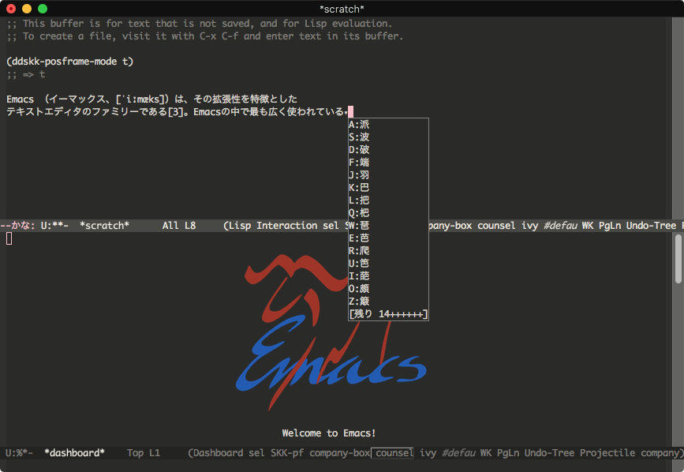
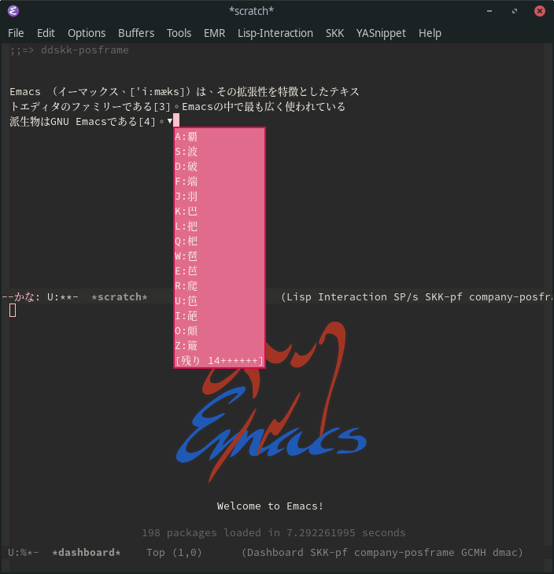


# 概要

[ddskk-posframe](https://github.com/conao3/ddskk-posframe.el/)は[conao3](https://github.com/conao3/)によって作成された、ddskkツールチップの[posframe](https://github.com/tumashu/posframe)フロントエンドです。

posframeを利用しているので、次のスクリーンショットのようにウィンドウの境界を越えて自由な位置に適切にツールチップを表示できます。




# 使用方法


## インストール

leafを利用してインストールします。

```emacs-lisp
(leaf skk
  :ensure ddskk
  :custom ((default-input-method . "japanese-skk"))
  :config
  (leaf ddskk-posframe
    :ensure t
    :global-minor-mode t))
```


## 操作

`ddskk-posframe-mode` が有効になっている間、ddskkのツールチップをposframeで表示します。


## カスタマイズ

機能が単一で、そもそもddskkにおいてツールチップがでるような変換をする機会が少ないので、カスタマイズする項目も動機もあまりありませんが、 `ddskk-posfrme` や `ddskk-posframe-boarder` を変更すれば魅力的なオリジナルのツールチップを作れるかもしれません。

```emacs-lisp
(leaf ddskk-posframe
  :custom ((ddskk-posframe-border-width . 2))
  :custom-face ((ddskk-posframe . '((t (:background "#e16b8c"))))
                (ddskk-posframe-border . '((t (:background "#d0104c"))))))
```



ツールチップ1画面に表示する候補件数などの調整はddskk-posframeではなく、ddskkの設定で行ないます。


# まとめ

posframeを使うと「モダンなエディタ」感が増しますね。 posframeを利用するパッケージは他にもありますので、検索して頂ければと思います。 [MELPA - posframe](https://melpa.org/#/?q=posframe)

<!--
This file is generated from org file.
Please edit that org source instead of this file.

;; Local Variables:
;; buffer-read-only: t
;; End:
-->
