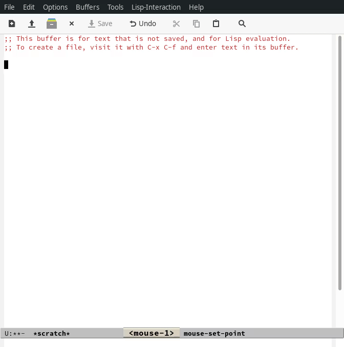
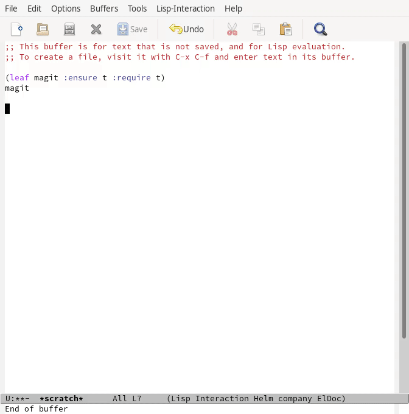


## 概要

Emacs初心者のための入門記事は[2020年代のEmacs入門](https://emacs-jp.github.io/tips/emacs-in-2020)に書きましたが、設定例が存在しない新しいパッケージを導入したいときどうすれば良いのでしょう。 また、設定例が古く、エラーが出てしまった。エラーは出ないが、どうにも動作がおかしい。というときどうすれば良いのでしょう。 有識者に聞く([EmacsJP - Slack](https://emacs-jp.github.io/#slack---emacs-jpslackcom))にも、upstreamにIssueを立てるにも、手元である程度の情報収集はしておきたいという声はあると思います。

この記事はそれらについて、最初の第一歩のアドバイスを提供するものです。

また、まとめにも書いていますが、この記事に書いたことを実施しないと質問してはいけないなどと主張するつもりはないので、その点は気軽に見て頂ければと思います。

## Emacsの設定の導入

### パッケージを見つける

パッケージを導入するためには、まず目的のパッケージを見つける必要があります。 現代ではパッケージレポジトリとして[MELPA](https://melpa.org/)と[ELPA](https://elpa.gnu.org/)の2種類があり、主にこれらから検索することとなります。

それぞれのアーカイブの特徴について整理します。

ELPAはGNUが管理しているアーカイブで、登録されるには[emacs-devel](https://lists.gnu.org/archive/html/emacs-devel/)というGNUが管理するMLに投稿が必要です。 とても登録のハードルが高いため、各開発者渾身の作品が登録されています。 しかしパッケージのアップデートのタイミングは基本的にタグリリースごととなるので、各パッケージの最新機能を使いたいという目的には向きません。

MELPAは有志が管理しているアーカイブで、登録されるにはGitHubの[MELPA/MELPA](https://github.com/melpa/melpa/pulls)にレシピのPRを提出し、マージされる必要があります。 こちらはある程度の水準は保たれていますが、玉石混交でメンテナンスが放棄されているパッケージも多くあります。 筆者はメンテナンスが放棄され、さらにMELPAメンテナさんによるレシピ変更の許可が下りない場合などに対応するために独自で[CELPA](http://celpa.conao3.com/)を運用するなど、みなさん工夫されています。

MELPA/ELPAの使い分けですが、両方のアーカイブにパッケージが登録されている場合は、無設定で必ずMELPA版のパッケージがインストールされるようになっています。 片方のアーカイブにしか登録されていないものは、当然そのアーカイブさらインストールされます。 注意点として、MELPAのパッケージがMELPAになく、ELPAにしかないパッケージに依存している場合があるので、必ずMELPAとELPAの両方を設定する必要がある点です。 これらについては[2020年代のEmacs入門](https://emacs-jp.github.io/tips/emacs-in-2020)に沿って設定すれば大丈夫です。

### パッケージを導入する

導入したいパッケージを見つけたら、早速Emacsにインストールしましょう。 [2020年代のEmacs入門](https://emacs-jp.github.io/tips/emacs-in-2020)に書いたとおり、現代では[leaf](https://github.com/conao3/leaf.el)を使ってパッケージを管理する方法が一番簡単です。 leafの導入については[2020年代のEmacs入門](https://emacs-jp.github.io/tips/emacs-in-2020)を参照してください。

今回は[magit](https://github.com/magit/magit)を導入したいとしましょう。 様々な方法がありますが、今回は私がいつも行なっている `*scratch*` バッファを利用したインストール方法を紹介します。

1.  `*scratch*` バッファを開く
2.  おもむろに `(leaf {{pkg-name}} :ensure t :require t)` と入力
3.  S式の末尾で `C-j` 押下
4.  (インストール待ち)
5.  プリントされたシンボルにポイントを合わせ、 `M-.` で定義ジャンプ
6.  `Commentary` セクションを確認
7.  Enjoy!

gifについてコメントします。

上記でリストしている動作を順に実行しています。 magitの場合、 `magit` というコマンドは `magit-status` のエイリアスのため `magit-status` ファイルにジャンプしました。 今回は少し例が悪く、 `Commentary` セクションには有用なコメントが記載されていませんでした。 そのためエスパーで `M-x magit` をし、magitの起動を正常に確認したというgifアニメです。

1.  なぜleafでrequireを書くのか

    オプショナルな発展内容です。 私はいつもleafに `require` は必要ないと言っています(ソース無し)が、なぜ `*scratch*` でインタラクティブにインストールするときには `require t` を付けているのでしょうか。
    
    それは `:ensure` でパッケージをインストールしただけだと本当の定義が読み込まれていないため、正しく定義ジャンプできないからです。
    
    init.elに設定を書く場合に `require` は必要ないというのはいつも言っている通りなので、init.elに書くときはそのキーワードについては削っています。

### パッケージの設定方法はどこに

`Commentary` にはパッケージを利用するにあたり、簡潔で有用なコメントが記載されている場合が多くあります。 そのため、 `Commentary` は最優先で確認するべきセクションです。 さらにgifでは省略してしまいましたが、定義ジャンプして `magit-status.el` を開いている状態で `C-x C-f (find-file)` することでパッケージに含まれているElispファイルを一覧することができます。 `Commentary` セクションはそれぞれのElispファイルに用意されているので、全部は確認する必要はありませんが、気になるファイルは確認すると有用な情報があるかもしれません。

今回のmagitの場合、[親切なinfo](https://magit.vc/manual/magit/)が用意されていることなどを理由に省略してあるのだと思います。

さらに[upstreamのREADME](https://github.com/magit/magit/)も有用な情報源です。 magitにはfaqやwikiが用意されていることなどが確認できます。

まとめると以下のようになります。

-   `Commentary` セクション
-   同一パッケージの他Elispファイルの `Commentary` セクション(定義ジャンプ後 `C-x C-f (find-file)` で探せる)
-   GitHubその他の、パッケージupstreamのREADME
-   README記載の追加リンク(issue, info, wiki, forum&#x2026;)
-   Googleでオープン検索。作者のブログ記事などを発見できるかも。。？
    
    (最終手段。情報が古く、さらに混乱する場合がある。 公式の情報源で上手くいかない場合、すぐissueを開き作者に報告した方が他の人のためにもなるかもしれない。)

### パッケージを自力で設定する

`Commentary` を見た。GitHubのREADMEを見た。infoやissueは長すぎて見てられない。くらいの状況になったら、面倒なので(私は)自分で設定を模索し始めます。 ここでも `M-.` による定義ジャンプは強力です。

gifについてコメントします。 ここでは `defcustom` できる変数を探して、期待する型の値を設定しています。

-   `magit-shell-command-verbose-prompt` について
    -   `magit` で定義ジャンプ、 `magit.el` を開いた。
    -   `defcustom` で検索、 `defcustom` で宣言されている `magit-shell-command-verbose-prompt` という変数を見つけた。
    -   `defcustom` の定義より `magit-shell-command-verbose-prompt` が真偽値を期待していることを知った。
    -   `*scratch*` に戻り、 `magit-shell-command-verbose-prompt` を `:custom` にて `t` に設定した。
        -   これはデフォルト値なので、この設定に意味はない。(なぜ `nil` で例示しなかった。。)
-   `C-x C-j (dired-jump)` でdiredを開いて、 `magit-status.el` を開いた。
    -   `defcustom` で検索、 `defcustom` で宣言されている `magit-status-use-buffer-arguments` という変数を見つけた。
    -   `defcustom` の定義より `magit-shell-command-verbose-prompt` が特定のシンボルを期待していることを知った。
    -   `always`, `selected`, `current`, `never` のうち、 `always` をleaf の `:custom` にて設定した。
-   おもしろそうな関数がないか `autoload` で検索した。
    -   `autoload` 指定されているものは、パッケージのエントリーポイントとなる関数です。これは重要な関数であることが多いです。
-   おもしろそうな関数がないか `interactive` で検索した。
    -   `interactive` 指定されているものは、 `M-x` で起動できるものです。これも重要な関数であることが多いです。

`defcustom` で指定できる変数の型はドキュメントに記載があります。

-   Simple Types ([en](https://www.gnu.org/software/emacs/manual/html_node/elisp/Simple-Types.html), [ja](https://ayatakesi.github.io/lispref/27.1/html/Simple-Types.html))
-   Composite Types ([en](https://www.gnu.org/software/emacs/manual/html_node/elisp/Composite-Types.html), [ja](https://ayatakesi.github.io/lispref/27.1/html/Composite-Types.html))

## Emacs-lispのデバッグ

### バックトレースの取得とデバッガの起動

Emacsには標準で[edebug](https://ayatakesi.github.io/lispref/27.1/html/Edebug.html#Edebug)というデバッガが付属しており、S式単位でのステップ実行ができ、とても便利です。 しかしこのパッケージについてはelispプログラミングの話に入ってしまうので、この章では簡単なエラーについて情報を集めるためのアドバイスを書きます。

まず全てのEmacsユーザーに勧められる設定が `debug-on-error` を `t` にするということです。 これはエラーが起こったときにデバッガを起動し、バックトレースを表示するという機能です。 基本的にIssueを立てる際にもこのバックトレースは基本情報として開発者の人は求めています。 このデバッガはバックトレースにフォーカスした状態で `q` を押下することでデバッガから出ることができます。 (このバックトレースの画面でもいろいろ便利な操作ができるのですが、それも別記事にします。)

他のプログラミング言語にも共通すると思いますが、デバッグで必要なことは「エラー発生地点でとにかく止める」ことです。 止めることができれば、その時点での変数の値を確認したり、(これは言語によりますが、)自由な式を動的に実行したりするチャンスがあるかもしれません。 エラーがどの関数で起こって、その関数までにどの道順(callstack)で到達したのかという情報も重要です。

Elispのデバッガを起動する他のトリガーについては[エラーによるデバッガへのエンター](https://ayatakesi.github.io/lispref/27.1/html/Error-Debugging.html)を参照してください。

さらに[無限ループのデバッグ](https://ayatakesi.github.io/lispref/27.1/html/Infinite-Loops.html)という項もあり、そこでは `debug-on-quit` という変数が紹介されています。 このトリガーはとても強力で、 `C-g` を押すとその状態でデバッガに入るという機能です。 Emacsユーザーはいろいろな場所で `C-g` を連打しているので普段この機能をオンにしていると煩わしいですが、止まらないプログラムのデバッグにはとても有用です。

gitをアンインストールしてmagitを起動するともちろんエラーになります。 その状況で上記のgifを撮影しました。

初期状態。つまり `debug-on-quit` ではエラーは単なるメッセージと変わらず、メッセージも簡素で途方に暮れてしまいます。 そしてこのメッセージをIssueに書いてもおそらく「バックトレースを下さい」とメンテナに言われることでしょう。 次に `debug-on-quit` を `t` に設定した上で同様に `magit` を起動します。 そうすると `magit` がラッパーを起動し、最終的にElispのプリミティブである `call-process` で `git` を起動しているところが分かります。 どうやら `git` がないらしいというのは `(executable-file "git")` が空なことからも確認できました。 このEmacsが動いているのはArch Linuxなのでpacmanからgitをインストールすると正常に `(executable-file "git")` でgitの場所が返却され、magitが起動できました。

ちなみに `(executable-file "git")` がきちんと実行ファイルの場所を返すことを確認することは重要です。 システムのPATHとEmacsが認識しているPATHがずれていることがあり、システムにインストールしているのにEmacsから実行ファイルが見えないというのは良くある不具合だからです。

### エラーは出ていないが何かがおかしい

「エラーが出ていないが何かがおかしい」という状況は明らかだとは思いますが、デバッグするのはとても難しいです。 ひとまず `*messages*` バッファにそれっぽいメッセージが出ていないか確認しましょう。

さらに[lsp](https://github.com/emacs-lsp/lsp-mode)を使っている場合は `*lsp-log*` にワーニングが出ている可能性があります。 このように `*` で囲われたバッファはパッケージが自動作成したシステムバッファであり、 `C-x b (switch-buffer)` で `*` を入力し、バッファを探しましょう。(helmかivyを入れていることを前提にしています。)

さらに `<空白>*` が前置されたバッファはユーザーが通常必要としないのでデフォルトでリストされないようになっています。 (ivyの場合は)明示的に `<空白>*` と入力した場合、リストされます。これも探してみましょう。

### emacs -qで再現するか

Emacsは無制限に個人の設定を書くことができます。 そのためデバッグを行なうには問題の切り分けを行う必要があります。

このときに極めて重要なのが `emacs -q` で起動するということです。 これはホームディレクトリの `~/.emacs.d/init.el` を読み込まないというEmacsの起動オプションです。

さらにEmacsは `-l <file>` というオプションがあり、これは指定されたファイルを起動時にファイルを読み込むということです。 つまり `-q` と `-l <file>` を合わせて使うことにより、個人設定のinit.elと独立した別のinit.elを読み込ませ、クリーンな環境でおかしな挙動が再現するかをテストすることができます。

私が現在メンテナンスしているhelm-swoopに[最近受け取ったissue](https://github.com/emacsorphanage/helm-swoop/issues/196)を見てみましょう。 issue主は再現手順を書いてくれていますが、これはメンテナが求める最低限の情報を満たしていません。 正直、以前の私ならissueの再現確認もせず放置していたと思います。

[私の(もう一人のメンテナに向けた)コメント](https://github.com/emacsorphanage/helm-swoop/issues/196#issuecomment-703126108)を見てみましょう。 最小限のinit.elを提示し、 `emacs -q -l <file>` で起動し、問題が再現することを主張しています。 この件は今回の話題通り、エラーが発生せず、なぜかうまく動かないという例です。 そのためバックトレースに関しては取得することはできないので、この件に関しては必要ありません。 エラーが出る場合はバックトレースが欲しいです。

今回の例はそもそもissueのテンプレートを用意していなかった私達の落ち度ではありますが、手元で最小限の環境を作り、再現することを確認することは重要な点だと思います。 このステップで問題が解決するなら問題の切り分けができたということで、個人設定のどこかがおかしいことになります。

## まとめ

Emacsの新パッケージの導入とパッケージを導入したときのトラブルをどのように解決するのかについて私のフローを説明しました。 Emacsは歴史のあるソフトウェアです。当然その歴史に比例するようにたくさんの付随するパッケージが開発されています。 そのパッケージたちの力を効率良く借りて、普段のコーディング環境の向上を実現しましょう!

なお、この記事で書いたことはあくまでアドバイスなので、この記事に書いたことを完全に理解して、これらを実施しないとEmacsJPで質問したりIssueを立ててはいけないということを主張するつもりはありません。 特に[EmacsJPのSlack](https://emacs-jp.github.io/#slack---emacs-jpslackcom)については、逆に初心者からの質問をみんなで待っている(笑)という状況なので、どんどん質問して頂ければと思います。

<!--
This file is generated from org file.
Please edit that org source instead of this file.

;; Local Variables:
;; buffer-read-only: t
;; End:
-->
